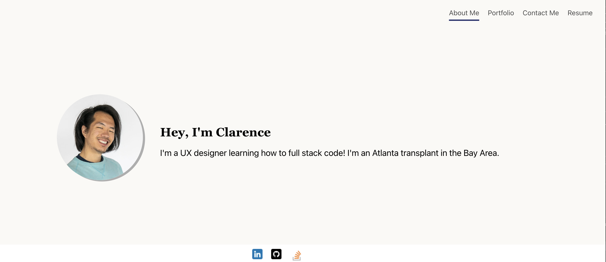

# Clarence's Portfolio 

## Description

This is a React based portfolio showing my development skills to those interested. It descrbses a brief bio with picture, past projects, my CV, and a way to contact me.

## Table of Contents

- [Installation](#installation)
- [Technology](#technology)
- [License](#license)

## Installation

This is a browser based application. No extra installation steps are required to run this application. To run the application open it in your browser.

## Deployment Link

URL to deployed application:
https://hiclarence.github.io/react-portfolio/

## Technology 

- React
- Node JS
- HTML / CSS

## License

MIT License

